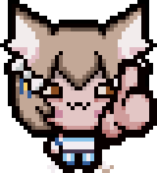

(o yea I dont use this account lol)

# 🦦 vxheme ❤️ of 🕶 & 🎨 
<!---I love otters--->

Game Dev

I rarely upload stuff

_"I exist ig,"_ -Me, influential Midwestern philosopher of the Ming Dynsasty, cicra 99 BC (Colourized); moments before the fall of Atlantis.
(⌐■_■)

# 🔗 Links

@vxheme some other places

# 💻 Programming

       

<!---actual human languages as well lol--->

# 🎨 Art

       

<!---finish adding tools including art stuff--->

(ill finish this later🥱)

<!---
Icons from devicon or just from the website
boo
idk what wonderous writing I'll weveal (reveal(~~uwu~~)); or ingenous ideals I'm inclined to impart; yea that's it go away
--->

