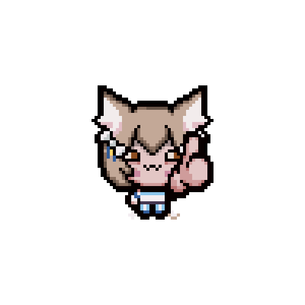

# 🦦 vxheme
<!---I love otters--->

Game Dev

I rarely upload stuff

# 🔗 Links

<!---icons here--->

[Itch.io](vxheme.itch.io/) 

[Tumblr](tumblr.com/vxheme)

[Twitter](https://twitter.com/vxheme)

@vxheme everywhere else

# 💻 Languages 

       

<!---actual human languages as well lol--->

# 🛠 Tools

       

<!---finish adding tools including art stuff--->

(ill finish this later🥱)

<!---
boo
idk what wonderous writing I'll weveal (reveal(~~uwu~~)); or ingenous ideals I'm inclined to impart; yea that's it go away
--->

